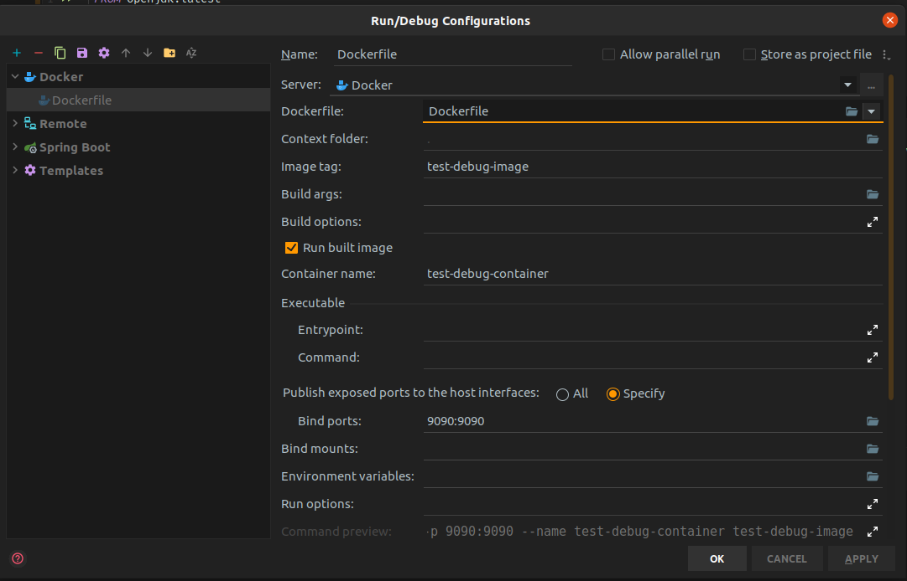
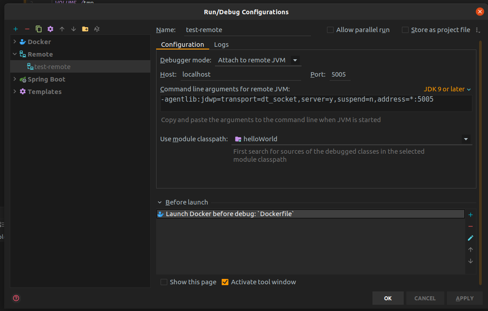
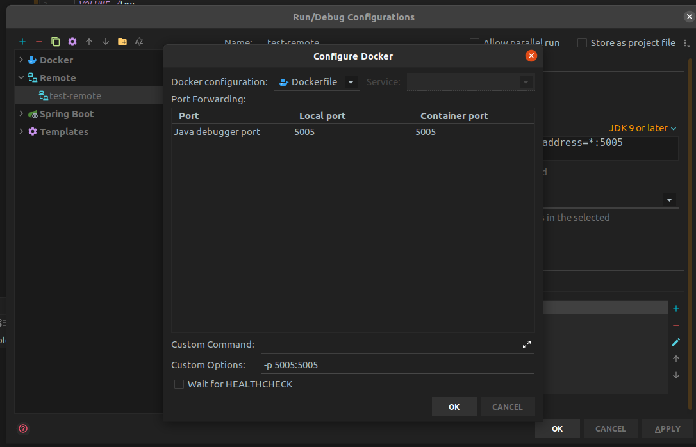

# Docker 2020

1. ### Docker commands
    - Docker version
    - Docker info

2. ## Container
    - docker container run --publish 80:80 nginx
    - docker container run --publish 80:80 --detach nginx
    - docker container ls
    - docker container stop <container-name>
    - docker container ls -a
    - docker container logs <container-name>
    - docker container top <container-name>
    - docker container rm ...<container-id-first-3-digit>


3. ## Docker Debugging with Intellij Idea
    - Create a Docker file and its Running Configuration (Just add Binding in its configuration)
        - Docker File
            ```
                FROM openjdk:latest
                LABEL maintainer="urehman.bese16seecs@seecs.edu.pk"
                VOLUME /tmp
                EXPOSE 9090
                ARG JAR_FILE=target/helloWorld-0.0.1-SNAPSHOT.jar
                ADD ${JAR_FILE} service.jar
                #ENTRYPOINT ["java", "-Djava.security.egd=file:/dev/./urandom", "-jar", "service.jar"]
                ENTRYPOINT ["java", "-agentlib:jdwp=transport=dt_socket,server=y,suspend=y,address=*:5005", "-Djava.security.egd=file:/dev/./urandom", "-jar", "service.jar"]
            ```
        - Docker Running Config (only binding)
            
    - Remote Running Config
        - Add Module which you want to debug
        - Add Lunch Docker before debug
         
    - Remote Java Debugger Config
        - Just add binding (5005) both for host and container 
         

# Docker 2019

1. #### Docker Important commands
    - for all docker containers **docker ps -a**
    - for all running docker containers **docker ps**
    - to run docker container **docker run image_name**
    - to run docker container in daemon **docker run -d image_name**
    - to map port use **docker -p port:port**
    - to check logs **docker logs -f container_id**
    - to add environment: use -e var:var-name
    - To include volume: (mongo db)
        - add -v and /to/path/:data/db
    - To commit the container: **docker commit container repository:tag**
      
2. #### Networking
    - creating network between docker-compose and external client 
        - **docker network create networkName**
        - **docker network connect --alias db networkName containerName**
    - Add this inside docker-compose networks
        - ```
              dbnet:
                  external: 
                      name: networkName
          ```
3. #### House Keeping
    - Kill all running containers: **docker kill $(docker ps -q)**
    - Delete all stopped containers: **docker rm $(docker ps -a -q)**
    - Remove a docker image: **docker rmi image-name**
    - Delete untagged images: **docker rmi $(docker images -q -f dangling=true)**
    - Delete all images: **docker rmi $(docker images -q)**
    - **docker volume rm $(docker volume ls -f dangling=true -q)**
    
4. #### Compact vhdx in windows
    - cd C:\Users\UbaidurRehman\AppData\Local\Docker\wsl\data
    - Optimize-VHD .\ext4.vhdx -Mode Full

5.  #### Logs
    - Check the logs of container: docker logs container_name
    - Tail the logs of container: docker logs -f container_name

6. #### Execute the shell of the container
    - docker exec -it container-name bash

7. #### Building Image from docker file:
    - docker build -t tag-name

8. #### Fabric 8 Plugin
    - mvn clean package docker:build
    - mvn clean package docker:build docker:push

9. #### Storing docker id and password in maven settings
    - right click on the blank screen and hit create maven settings or edit settings
    - now add servers->server->id, username, password
    
10. #### CentOS and Ubuntu to run
    - docker run -d `ubuntu or centos` tail -f /dev/null
    - ps -ef ~used to list the commands

11. #### Ubuntu Stuff
    - docker create -v /tmp --name datacontainer ubuntu (create volume container)
    - docker run -t -i --volumes-from datacontainer ubuntu /bin/bash

12. #### Notes
    - Use relative path in windows
